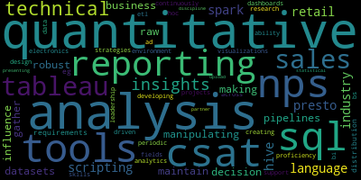

# indeed-scraper

## Summary
* [Problem](#Problem)
* [Project structure](#Structure)
* [Setup](#Setup)
* [Output](#Output)

#### Problem

* Determine the skills required for AR/VR jobs in Menlo Park,California.

#### Structure

* <b> /document </b> - A directory with report.
* <b> /images </b> - A directory with output images of analysis.
* <b> /out </b> - A directory with output containing extracted key skills.
* <b> IndeedScraper.ipynb </b> - It is a notebook for scraping data from indeed.com.
* <b> Analysis.ipynb </b> - It is a notebook with analysis on the scraped data.
* <b> raw_data.csv </b> - The generated CSV composed by job listings from indeed.
* <b> requirements.txt </b> - Python dependencies of the project.

#### Setup 

1. You need to have Jupyter Notebook installed to view/run code on your local machine.
2. Run `pip install -r requirements.txt` to install dependencies
3. Once dependencies are installed you are good to go.

#### Output

1. Sample output of AR/VR Analyst job postings  

  

from the result above if we split the keywords on " "   the most required skillsets for a AR/VR analyst role are as follows,
* SQL
* SPARK
* HIVE
* PRESTO
* Manipulating raw datasets
* Scripting language experience
* Tableau
* etc

